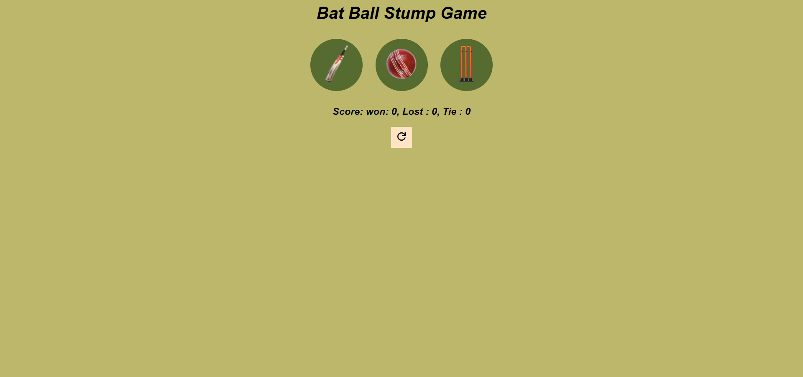

# Cricket Game — User vs Computer

A simple browser-based cricket game built with HTML, CSS, and JavaScript, where the player competes against the computer.

## Features

- User vs Computer gameplay
- batting/bowling choice, score tracking, wickets, etc.
- Simple, interactive UI

## Tech Stack

- HTML
- CSS
- JavaScript

## Live Demo

[Play the game here](https://vermakanika003.github.io/cricket-game-js/)

## How to Play

1. Open the live link above.
2. "Choose a bat/bowl icon for your choice. Then computer choose its own and the score shows on the screen itself.")

## Getting Started (Run Locally)

```bash
git clone https://github.com/VermaKanika003/cricket-game-js.git
cd cricket-game-js
```

Then simply open `index.html` in your browser — no build step or installation needed.

## Screenshots



## What I Learned

- DOM manipulation using vanilla JavaScript
- Handling game logic and user interaction without a framework
- Deploying a static site using GitHub Pages

## Author

**Kanika Verma**

[LinkedIn](www.linkedin.com/in/kanika-verma-0443b7315) | [GitHub](https://github.com/VermaKanika003)
